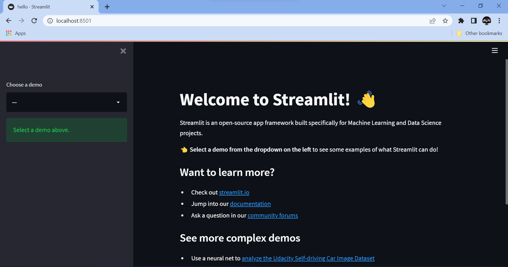
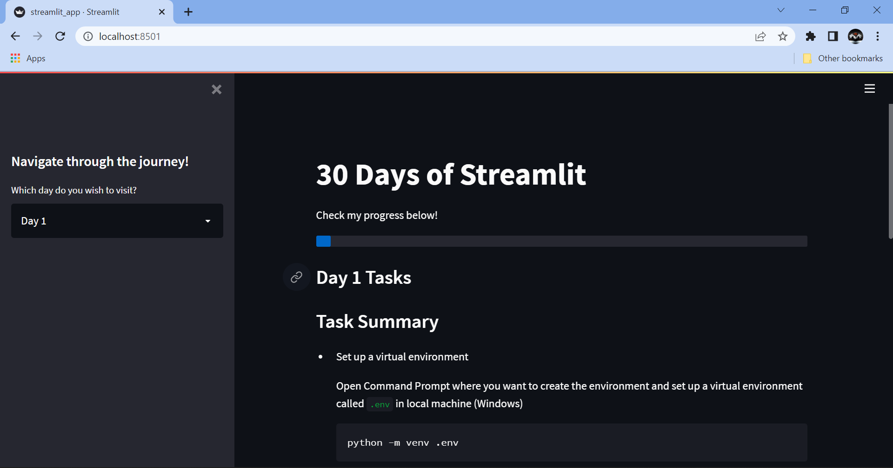
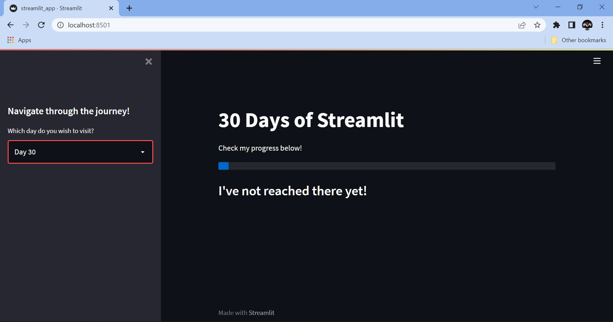
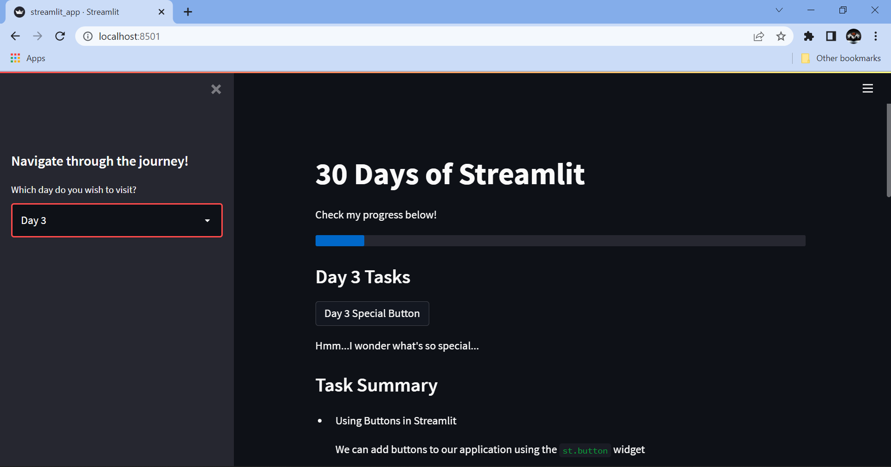
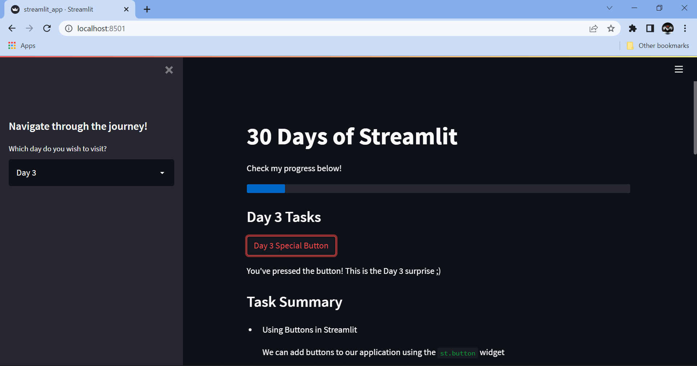

# 30 Days of Streamlit

I have always loved working with Streamlit, ever since I first discovered it.

The **30 Days of Streamlit** Challenge by [The Data Professor](https://youtube.com/dataprofessor) is one of the most exciting experiences I have had, and I would recommend everyone reading this to have a go at it as well!


## The Challenge

The **30 Days of Streamlit** Challenge is a campaign by Streamlit, in collaboration with Mr. Chanin Nantasenamat, also known as *The Data Professor*, to help interested people get involved in creating applications using the powerful and flexible Streamlit API and deploy them on Streamlit Cloud!

> Read more on the official [Blog Page](https://blog.streamlit.io/30-days-of-streamlit/)


## My take on the challenge

I fell in love with the idea of a consistency challenge related to the Python module I use extensively; thus, I am going to document each of the 30 days of the challenge in this repository, summarising key moments of learning from the day's work.


## My Goals

By taking up the challenge, I wish to accomplish the following goals:

- Become proficient in using the various attributes and features offered by Streamlit
- Increase speed and efficiency while using Python, especially when working with Streamlit and related modules from my domain of interest
- Develop and maintain consistency, not just through the challenge but also after the challenge is over
- Learn about the best practices for application deployment on Streamlit Cloud


## Timeline

<details open>
<summary>Day 1</summary>

### Task Summary

- Set up a virtual environment
    
    Open Command Prompt where you want to create the environment and set up a virtual environment called `.env` in local machine (Windows)
    ```
    python -m venv .env
    ```
- Activate the environment
    
    In the same folder, activate the environment using the following command:
    ```
    .env\Scripts\activate
    ```
- Install Streamlit
    
    Once the environment is activated, the name of the environment will appear before the root directory of the folder on Command Prompt. Install Streamlit here
    ```
    pip install streamlit
    ```
- Launch the Streamlit Demo App

    Run the following command to launch the `Streamlit Hello` Demo application
    ```
    streamlit hello
    ```

### Results



</details>

<details>
<summary>Day 2</summary>

### Task Summary

- Create a Python File

    Using the file name `streamlit_app.py` enables deployment directly under the GitHub repository name instead of the specific file name

- Write some code

    Import Streamlit and write some code for your streamlit application!

    ```
    import streamlit as st

    st.title('30 Days of Streamlit')
    st.header('Welcome to my application!')
    ```

- Launch the app from your terminal

    Using the command line interface, run the streamlit application on localhost

    If you have a virtual environment, activate it from the command line (Windows)
    ```
    .env\Scripts\activate
    ```
    Launch the application from the command line
    ```
    streamlit run streamlit_app.py
    ```

### Results





</details>

<details>
<summary>Day 3</summary>

### Task Summary

- Using Buttons in Streamlit

    We can add buttons to our application using the `st.button` widget
    ```
    import streamlit as st
    
    st.title("30 Days of Streamlit")
    
    st.button("I am a button")
    ```

- Add button-dependant code to the application

    We can program certain events to occur once a button is clicked and when it is not clicked

    ```
    import streamlit as st

    st.title('30 Days of Streamlit')
    st.header('Welcome to my application!')

    if st.button("Click Me"):
        st.write("This is a message from the button!")
    
    bt1 = st.button("Button 2")
    if bt1:
        st.write("You clicked button 2")
    else:
        st.write("You have not clicked button 2")
    ```

- Launch the app from your terminal

    Using the command line interface, run the streamlit application on localhost

    If you have a virtual environment, activate it from the command line (Windows)
    ```
    .env\Scripts\activate
    ```
    Launch the application from the command line
    ```
    streamlit run streamlit_app.py
    ```

### Results





</details>

<details>
<summary>Day 4</summary>

### Task Summary

- Set up a new environment for a Streamlit app
    
    > Read [here](#task-summary) for details

- Get data from Kaggle Dataset

    > Dataset available [here](https://www.kaggle.com/datasets/kenjee/ken-jee-youtube-data)

- Perform Exploratory Data Analysis

    > Explained by Ken Jee [here](https://www.youtube.com/watch?v=Yk-unX4KnV4)

- Store the app and related data in a GitHub repository

    Upload the project to GitHub in a repository and define a README file explaining its details!

- Deploy the application on Streamlit Cloud from the GitHub Repository

    Launch the app using localhost, then select 'Deploy on Streamlit Cloud' from the navigation menu on the top right. Follow the instructions and set up the project accordingly for deployment.

- Update README file with link to Application

    Once deployed, copy the application URL and link to it in the README using [this](https://static.streamlit.io/badges/streamlit_badge_black_white.svg) Streamlit Badge!


### Results


</details>