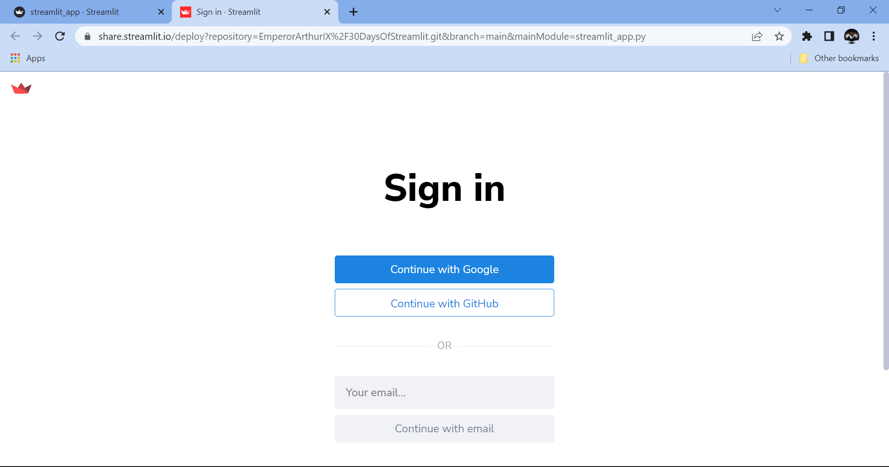

[](https://share.streamlit.io/emperorarthurix/30daysofstreamlit/main)

# 30 Days of Streamlit

I have always loved working with Streamlit, ever since I first discovered it.

The **30 Days of Streamlit** Challenge by [The Data Professor](https://youtube.com/dataprofessor) is one of the most exciting experiences I have had, and I would recommend everyone reading this to have a go at it as well!


## The Challenge

The **30 Days of Streamlit** Challenge is a campaign by Streamlit, in collaboration with Mr. Chanin Nantasenamat, also known as *The Data Professor*, to help interested people get involved in creating applications using the powerful and flexible Streamlit API and deploy them on Streamlit Cloud!

> Read more on the official [Blog Page](https://blog.streamlit.io/30-days-of-streamlit/)


## My take on the challenge

I fell in love with the idea of a consistency challenge related to the Python module I use extensively; thus, I am going to document each of the 30 days of the challenge in this repository, summarising key moments of learning from the day's work.


## My Goals

By taking up the challenge, I wish to accomplish the following goals:

- Become proficient in using the various attributes and features offered by Streamlit
- Increase speed and efficiency while using Python, especially when working with Streamlit and related modules from my domain of interest
- Develop and maintain consistency, not just through the challenge but also after the challenge is over
- Learn about the best practices for application deployment on Streamlit Cloud


## Timeline

<details open>
<summary>Day 1</summary>

### Task Summary

- Set up a virtual environment
    
    Open Command Prompt where you want to create the environment and set up a virtual environment called `.env` in local machine (Windows)
    ```
    python -m venv .env
    ```
- Activate the environment
    
    In the same folder, activate the environment using the following command:
    ```
    .env\Scripts\activate
    ```
- Install Streamlit
    
    Once the environment is activated, the name of the environment will appear before the root directory of the folder on Command Prompt. Install Streamlit here
    ```
    pip install streamlit
    ```
- Launch the Streamlit Demo App

    Run the following command to launch the `Streamlit Hello` Demo application
    ```
    streamlit hello
    ```

### Results


</details>

<details>
<summary>Day 2</summary>

### Task Summary

- Create a Python File

    Using the file name `streamlit_app.py` enables deployment directly under the GitHub repository name instead of the specific file name

- Write some code

    Import Streamlit and write some code for your streamlit application!

    ```
    import streamlit as st

    st.title('30 Days of Streamlit')
    st.header('Welcome to my application!')
    ```

- Launch the app from your terminal

    Using the command line interface, run the streamlit application on localhost

    If you have a virtual environment, activate it from the command line (Windows)
    ```
    .env\Scripts\activate
    ```
    Launch the application from the command line
    ```
    streamlit run streamlit_app.py
    ```

### Results


</details>

<details>
<summary>Day 3</summary>

### Task Summary

- Using Buttons in Streamlit

    We can add buttons to our application using the `st.button` widget
    ```
    import streamlit as st
    
    st.title("30 Days of Streamlit")
    
    st.button("I am a button")
    ```

- Add button-dependant code to the application

    We can program certain events to occur once a button is clicked and when it is not clicked

    ```
    import streamlit as st

    st.title('30 Days of Streamlit')
    st.header('Welcome to my application!')

    if st.button("Click Me"):
        st.write("This is a message from the button!")
    
    bt1 = st.button("Button 2")
    if bt1:
        st.write("You clicked button 2")
    else:
        st.write("You have not clicked button 2")
    ```

- Launch the app from your terminal

    Using the command line interface, run the streamlit application on localhost

    If you have a virtual environment, activate it from the command line (Windows)
    ```
    .env\Scripts\activate
    ```
    Launch the application from the command line
    ```
    streamlit run streamlit_app.py
    ```

### Results


</details>

<details>
<summary>Day 4</summary>

### Task Summary

- Set up a new environment for a Streamlit app
    
    > Read [here](#task-summary) for details

- Get data from Kaggle Dataset

    > Dataset available [here](https://www.kaggle.com/datasets/kenjee/ken-jee-youtube-data)

- Perform Exploratory Data Analysis

    > Explained by Ken Jee [here](https://www.youtube.com/watch?v=Yk-unX4KnV4)

- Store the app and related data in a GitHub repository

    Upload the project to GitHub in a repository and define a README file explaining its details!

- Deploy the application on Streamlit Cloud from the GitHub Repository

    Launch the app using localhost, then select 'Deploy on Streamlit Cloud' from the navigation menu on the top right. Follow the instructions and set up the project accordingly for deployment.

- Update README file with link to Application

    Once deployed, copy the application URL and link to it in the README using [this](https://static.streamlit.io/badges/streamlit_badge_black_white.svg) Streamlit Badge!


### Results


<!--  -->

</details>

<details>
<summary>Day 5</summary>

### Task Summary

- Write Text in Streamlit

    We can add text to our application using the `st.write` function
    ```
    import streamlit as st
    
    st.title("30 Days of Streamlit")
    
    st.write("This is written using `st.write`")
    ```

- Versatility of `st.write`

    The write function can be used to display not just text, but also:

    - Markdown strings, like `st.markdown()`
    - Python dictionaries, lists, tuples
    - Pandas DataFrame, as a table
    - Plots/graphs/figures from `matplotlib`, `plotly`, `altair`, `graphviz`, `bokeh`
    
    And the list goes on!

    ```
    import streamlit as st
    import pandas as pd

    st.title('30 Days of Streamlit')
    st.header('Welcome to my application!')

    st.write("Hello world!")

    st.write(2*3.14)

    st.write(
        "#### This is a subheading\n",
        "\nThis line follows the subheading\n",
        "\nThese three lines are written in Markdown, using the same function!")

    st.write(pd.DataFrame([[j*i for j in range(5)] for i in range(5)]))
    ```

- Launch the app from your terminal

    Once the app is ready, open the command line interface and run the streamlit application on localhost

    If you have a virtual environment, activate it from the command line (Windows)
    ```
    .env\Scripts\activate
    ```
    Launch the application from the command line
    ```
    streamlit run streamlit_app.py
    ```

### Results


</details>

<details>
<summary>Day 6</summary>

### Task Summary

- Sign Up/ Login to GitHub

    Proceed to [GitHub](https://www.github.com) and enter your credentials to access your profile. Here, the Streamlit App shall be uploaded in a repository

- Create a Repository for the application
    
    Choose an appropriate name, relevant to your application, and create a repository in which the code and dependencies of the application may be stored
    
    This may be done by the Command Line Interface provided by GitHub, or by using GUI on the website

- Upload files to the repository

    You can open the repository on the GitHub web page, then drag and drop the files relevant to the project there

    OR

    Use GitHub from the command line to connect a local project repository to the remote repository on GitHub, then push code onto it


### Results


</details>

<details>
<summary>Day 7</summary>

### Task Summary

- Make sure the application on GitHub is stable

    Before deploying the application on the cloud, we must make sure that the app runs stably and can sustain itself online

- Launch the application through the terminal

    If you have a virtual environment, activate it from the command line (Windows)
    ```
    .env\Scripts\activate
    ```
    Launch the application from the command line
    ```
    streamlit run streamlit_app.py
    ```

- Login/Sign Up for Streamlit Cloud

    On being taken to the Streamlit Cloud deployment page, enter your credentials to gain access to the deployment menu

- Deploy a new application from an existing repository

    From the dropdown menu, choose `from an existing repository` to link your application to the GitHub repository in which your streamlit application is uploaded! Make sure to check advanced settings and change the Python Version to the one you used during development!


### Results


#### Deployment Menu


#### Making sure GitHub is up-to-date and stable


#### Log in to Streamlit Cloud



#### Deploy from existing repository


#### Link repository to cloud


#### Choose Python version


#### Wait till build completes, then share your app!


</details>

<details>
<summary>Day 8</summary>

### Task Summary

- Use `st.slider` to get numeric or range input from user

    The `st.slider` widget allows for user input as a number, or a range, without the user having to type anything; instead, by dragging a slider.
    ```
    import streamlit as st
    
    st.title("30 Days of Streamlit")

    sal = st.slider("Enter Salary:", min_value=1000, max_value=10000)

    st.write("Your tax at 5% is: " + str(round(sal*0.05, 2)))
    ```

- We can even use the slider to take in a range

    By passing the `value` argument as a tuple or list, we can modify the slider to accept a range with default selected upper and lower limits specified in `value`
    ```
    import streamlit as st
    from datetime import time

    appointment = st.slider(
        "Schedule your appointment:",
        value=(time(11, 30), time(12, 45))
        )
    st.write("You're scheduled for:", appointment[0] - appointment[1])
    ```

- Launch the app from your terminal

    Once the app is ready, open the command line interface and run the streamlit application on localhost

    If you have a virtual environment, activate it from the command line (Windows)
    ```
    .env\Scripts\activate
    ```
    Launch the application from the command line
    ```
    streamlit run streamlit_app.py
    ```


### Results


</details>

<details>
<summary>Day 9</summary>

### Task Summary

- Use `st.line_chart` to display a range using a line plot

    The `st.line_chart` widget is a simplified version of `st.altair_chart`, made for ease of use
    ```
    import streamlit as st
    
    st.title("30 Days of Streamlit")

    st.line_chart(data=range(100))
    ```

- We can use the slider to take in a range, then define a plot using those values

    By passing the `value` argument as a tuple or list, we can modify the slider to accept a range with default selected upper and lower limits specified in `value`
    ```
    import streamlit as st
    import numpy as np

    rng = st.slider("Choose a range",0, 100, value=(25, 75))
    arr = np.random.randint(low=rng[0], high=rng[1], size=100)

    st.line_chart(data=arr)
    ```

- Launch the app from your terminal

    Once the app is ready, open the command line interface and run the streamlit application on localhost

    If you have a virtual environment, activate it from the command line (Windows)
    ```
    .env\Scripts\activate
    ```
    Launch the application from the command line
    ```
    streamlit run streamlit_app.py
    ```


### Results


</details>

<details>
<summary>Day 10</summary>

### Task Summary

- Use `st.selectbox` to display a list of options

    The `st.selectbox` widget is used to provide a dropdown list of options, out of which the user may choose only one
    ```
    import streamlit as st
    
    st.title("30 Days of Streamlit")

    st.selectbox("Gender", options=["Female", "Male", "Non-Binary"])
    ```

- We can use the select box in multiple ways

    In fact, here on this app, we have used the select box to help you navigate through the various days of this challenge!
    ```
    import streamlit as st

    day = st.sidebar.selectbox("Which day do you wish to visit?", ["Day " + str(i+1) for i in range(1,31)])

    st.subheader(day)
    ```

- Launch the app from your terminal

    Once the app is ready, open the command line interface and run the streamlit application on localhost

    If you have a virtual environment, activate it from the command line (Windows)
    ```
    .env\Scripts\activate
    ```
    Launch the application from the command line
    ```
    streamlit run streamlit_app.py
    ```


### Results


</details>

<details>
<summary>Day 11</summary>

### Task Summary

- Use `st.multiselect` to display a list of options

    The `st.multiselect` widget is used to provide a dropdown list of options, out of which the user may choose more than one
    ```
    import streamlit as st
    
    st.title("30 Days of Streamlit")

    countries = st.multiselect("Countries visited", ["India", "Sri Lanka", "Nepal"])
    ```

- We can use the select box in multiple ways

    It allows the user to choose multiple options, thus we may use it in cases where we want the user to choose a list of columns from a dataset, or a list of langauges for translation, or a set of data types to use, and so on
    ```
    import streamlit as st

    langs = st.multiselect("Which languages do you speak?", ['English', "Spanish", "German"])

    st.write("You speak:", *langs)
    ```

- Launch the app from your terminal

    Once the app is ready, open the command line interface and run the streamlit application on localhost

    If you have a virtual environment, activate it from the command line (Windows)
    ```
    .env\Scripts\activate
    ```
    Launch the application from the command line
    ```
    streamlit run streamlit_app.py
    ```


### Results


</details>